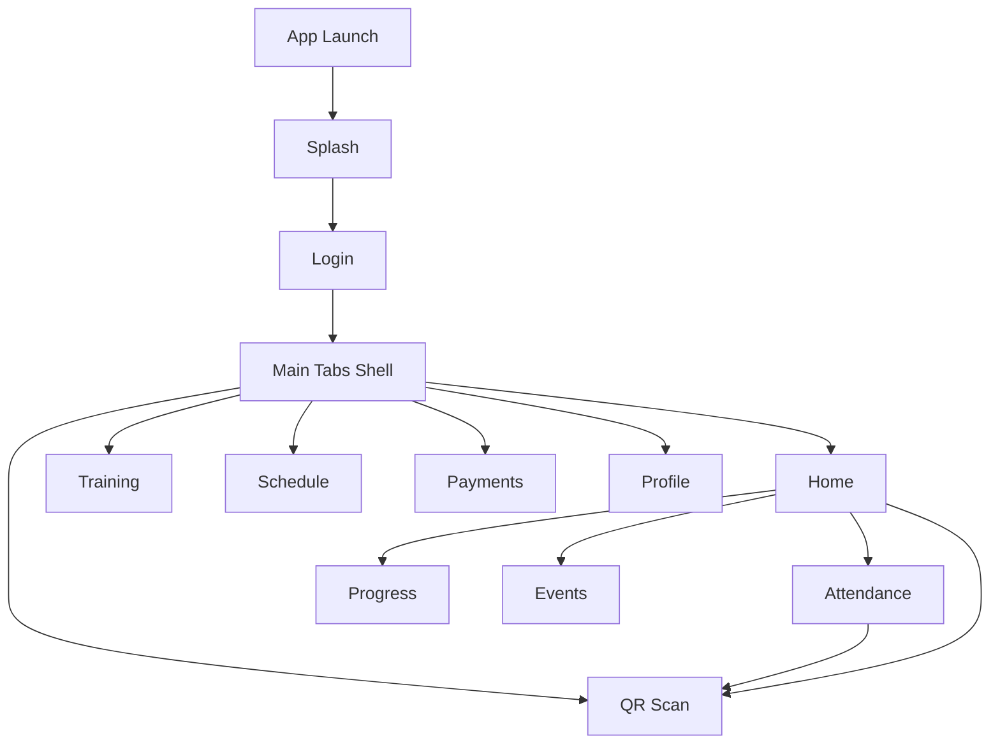

## 1. Product Overview
Refresh the Flutter app UI/UX to a modern, professional, consistent experience across all core user screens.
Improve navigation clarity, component consistency, and spacing/typography (excluding the API test screen).

## 2. Core Features

### 2.1 Feature Module
The UI/UX refresh scope includes these essential pages:
1. **Splash**: branded loading state and transition to login.
2. **Login**: clean sign-in form with role toggle, password visibility, remember-me, theme toggle.
3. **Main Tabs Shell**: bottom navigation + center QR FAB with consistent active state behavior.
4. **Home**: overview header, quick actions, fees due CTA, today’s class, quick access grid.
5. **Training**: training overview + program cards + add program CTA.
6. **Schedule**: day selector + session list + rest-day/holidays states.
7. **Payments**: next payment due, quick pay cards, payment history, pay flow modal.
8. **Profile**: profile header, virtual ID card, theme toggle, logout.
9. **Attendance**: attendance summary, month calendar, scan CTA, missed history.
10. **Progress**: fitness score, belt journey, skill breakdown, achievements, trainer feedback.
11. **Events**: segmented tabs (upcoming/registered/certificates), event cards, certificate list.
12. **QR Scan**: full-screen scanner with fallback state and success confirmation.

### 2.2 Page Details
| Page Name | Module Name | Feature description |
|-----------|-------------|---------------------|
| All | Visual system | Apply one design language: color tokens, typography scale, spacing/radius/shadows; reduce ad-hoc styling; standardize icon sizing and label casing. |
| All | Navigation consistency | Keep bottom tabs persistent for core sections; make QR scan entry consistent (center FAB + contextual CTAs); ensure back behavior is predictable on sub-pages. |
| All | Component consistency | Standardize cards, list rows, chips/segmented controls, buttons, banners, dialogs/bottom sheets, empty states, loading states. |
| Splash | Brand + loading | Show centered logo + short tagline + subtle progress/animation; transition to Login without jarring layout shifts. |
| Login | Form usability | Present role selector (Student/Instructor), ID + password fields, show/hide password, remember-me; provide clear focus/error/disabled/loading states. |
| Main Tabs Shell | Bottom navigation | Use consistent active indicator, readable labels, and touch targets; keep FAB visually integrated (center dock) and accessible. |
| Home | Dashboard hierarchy | Present greeting header + stats; provide quick actions (Attendance/Timetable/Virtual ID/Profile), fees due CTA, today’s class card, quick access grid. |
| Training | Program browsing | Display streak hero, list enrolled programs with progress, and add-program CTA using consistent card patterns. |
| Schedule | Day + sessions | Provide day scroller, session cards with actions, and clear rest-day empty state; keep holidays card visually distinct but on-brand. |
| Payments | Pay flow | Highlight next payment due; open pay bottom sheet to pick method and confirm; show payment success dialog; render payment history rows consistently. |
| Profile | Identity + settings | Show profile header, virtual ID card, theme toggle row, logout action; ensure settings affordances are consistent. |
| Attendance | Check-in + history | Provide attendance hero gauge, calendar with legend, scan CTA, missed history list; keep colors accessible for status meaning. |
| Progress | Progress insights | Present score hero, belt journey timeline, skill bars, achievement badges, trainer feedback cards with readable typography. |
| Events | Discover + certificates | Use segmented control tabs; list events with strong imagery + readable overlay; show certificate list with consistent row actions. |
| QR Scan | Camera flow | Provide scanner overlay, torch action, fallback if camera unavailable, and success state with “Done”. |

## 3. Core Process
**Primary user flow**
1. You open the app → see Splash.
2. You land on Login, choose role (Student/Instructor), enter credentials, and sign in.
3. You arrive in the Main Tabs Shell (Home default).
4. You switch between Home / Training / Schedule / Payments / Profile via bottom tabs.
5. You open supporting pages (Attendance/Progress/Events) from Home quick actions/quick access.
6. You check in by opening QR Scan (center FAB or contextual CTA) and completing scan.
7. You pay fees from Home/Payments and confirm in the payment bottom sheet.

