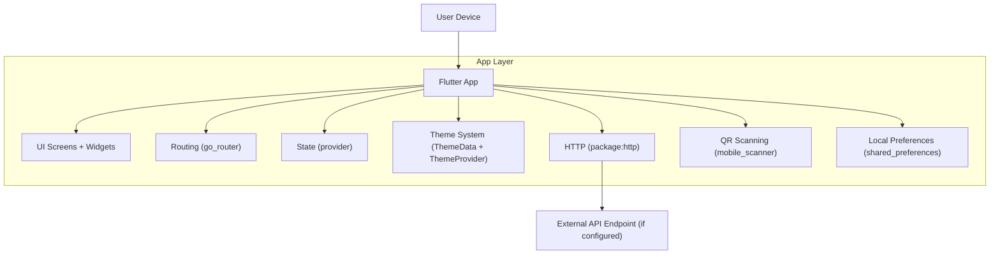

## 1.Architecture design

## 2.Technology Description
- Frontend: Flutter (Dart SDK >=3.3) + Material + google_fonts + cached_network_image
- Navigation: go_router (ShellRoute for bottom-tab shell)
- State: provider (ThemeProvider and app-level UI state)
- Device features: mobile_scanner (QR)
- Storage: shared_preferences (theme/prefs)
- Backend: None in this repo scope (UI refresh only; API calls are direct from the app when used)

## 3.Route definitions
| Route | Purpose |
|-------|---------|
| / | Splash screen (loading/brand intro) |
| /login | Login screen (role toggle + sign-in form + theme toggle) |
| /home | Home tab (dashboard + quick actions) |
| /training | Training tab (programs + streak hero) |
| /schedule | Schedule tab (day selector + sessions) |
| /payments | Payments tab (due card + history + pay modal) |
| /profile | Profile tab (virtual ID + theme toggle + logout) |
| /attendance | Attendance detail screen (calendar + scan CTA) |
| /progress | Progress detail screen (belt + skill breakdown) |
| /events | Events detail screen (segmented tabs + lists) |
| /qr-scan | Full-screen dialog scanner (QR check-in) |

## 6.Data model(if applicable)
Not required for this UI/UX refresh scope (no new entities/tables).