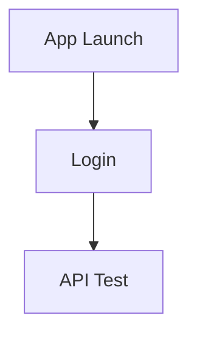

## 1. Product Overview
Refresh the existing app’s UI to look professional, feel consistent, and improve usability on the two main screens: Login and API Test.
Focus on a unified theme/components, clearer layouts, and more reliable form/button interaction states.

## 2. Core Features

### 2.1 Feature Module
Our UI/UX improvement requirements consist of the following main pages:
1. **Login**: consistent branded header, cleaner form layout, better field validation feedback, clearer primary action.
2. **API Test**: structured request builder, readable response area, consistent buttons/states, improved spacing and hierarchy.

### 2.2 Page Details
| Page Name | Module Name | Feature description |
|-----------|-------------|---------------------|
| Login | Visual hierarchy | Present clear app branding and a single primary path to login (title/logo + short helper text). |
| Login | Form usability | Improve input ergonomics: consistent label style, placeholder text, helper/error text, and field spacing. |
| Login | Validation & feedback | Show inline validation and submission feedback: required fields, invalid formats, loading state, and error message placement. |
| Login | Button system usage | Use consistent primary/secondary button styles, sizes, and disabled/loading behavior across the page. |
| API Test | Page layout | Separate the screen into clear areas: request inputs/actions and response output; avoid dense stacked blocks. |
| API Test | Request form clarity | Organize inputs with consistent component patterns (labels, helper text, spacing) and improve scan-ability. |
| API Test | Action feedback | Show request progress and outcome clearly: loading indicator, success/error styling, and persistent last-result view. |
| API Test | Response readability | Display response with readable typography, wrapping/scrolling behavior, and emphasis for status code/errors. |
| Both | Theme consistency | Apply a single design language: consistent colors, typography, corner radius, spacing scale, shadows, and icon usage. |
| Both | Accessibility basics | Ensure contrast, tappable target sizes, focus/active states, and readable error messages. |

## 3. Core Process
**User flow**
1. You open the app and land on the Login screen.
2. You enter credentials and tap the primary login button.
3. After success, you navigate to the API Test screen.
4. You fill the request fields, submit, and review the response output.

