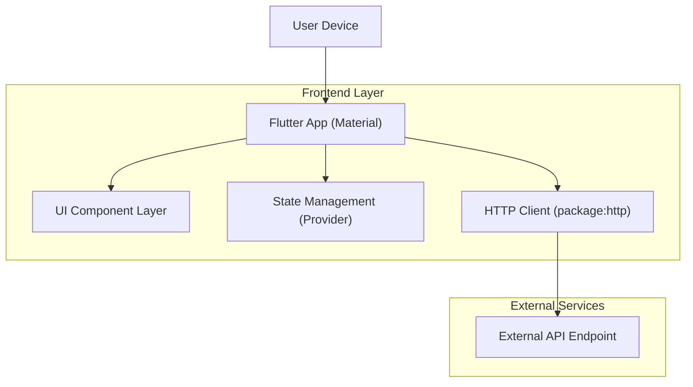

## 1.Architecture design

## 2.Technology Description
- Frontend: Flutter (Dart SDK >=3.3) + Material 3 + go_router + provider
- Backend: None (direct HTTP calls from app)

## 3.Route definitions
| Route | Purpose |
|-------|---------|
| /login | Login screen (form + submission feedback) |
| /api-test | API testing screen (request builder + response viewer) |

## 6.Data model(if applicable)
Not required for this UI/UX improvement scope (no new data entities).
